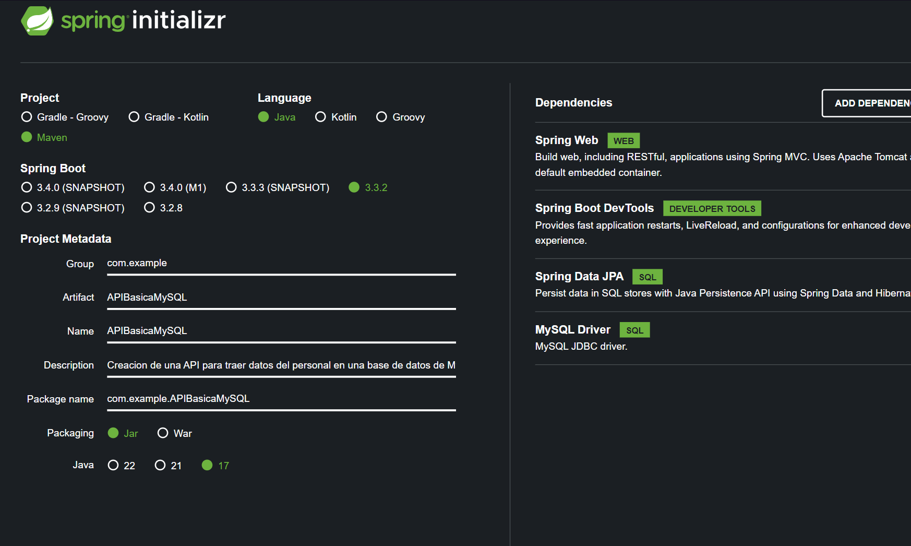
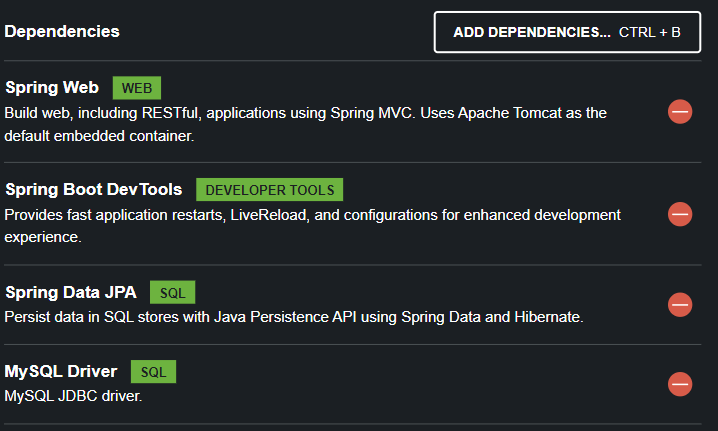
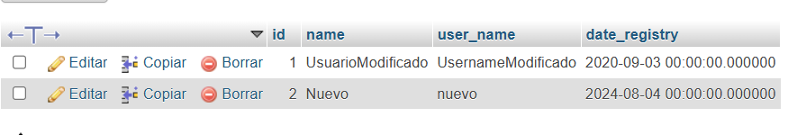
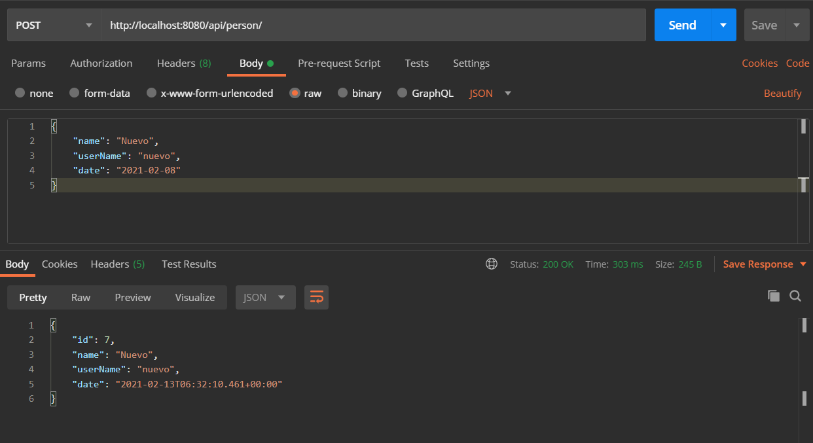
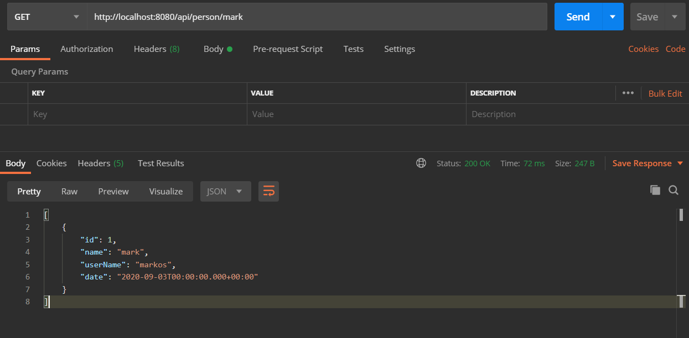
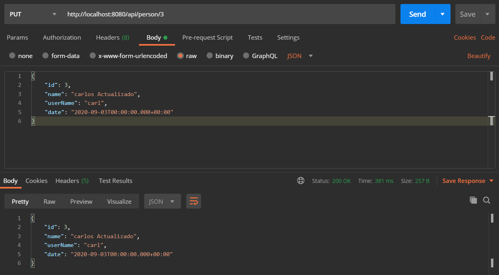

# Documentación del Proyecto API Básica MySQL

### **Configuracion del proyecto**
Para iniciar con nuestro proyecto lo realizaremos con spring initializr.


**Artifact:** APIBasicaMySql

**Name:** APIBasicaMySql

**Description** Creacion de una API para traer datos del persona en una base de datos de MySQL

Dependecies: Aquí buscaremos las dependencias que necesitemos, buscamos y agregamos las que se muestran a continuación.



### Base de Datos
La base de datos se encuentra dentro del proyecto en la carpeta de `Database` con el nombre de "**apisuarios**" y se puede exportar de forma directa en una base de datos con el servidor de phpmyAdmin en cualquier servicio de servidor local como Xampp o Wampp con es el caso de este proyecto

La tabla se muestra de la siguiente forma:



### 1. **Archivo `application.properties`**

**Descripción**: Configuración de la aplicación, incluyendo detalles de conexión a la base de datos, configuraciones de JPA y Hibernate, y otras propiedades.

```properties
# Nombre de la aplicación
spring.application.name=APIBasicaMySQL

# Configuración de la base de datos
spring.datasource.url=jdbc:mysql://localhost:3306/apiusuarios?serverTimezone=UTC
spring.datasource.username=root
spring.datasource.password=
spring.datasource.driver-class-name=com.mysql.cj.jdbc.Driver

# Configuración de JPA e Hibernate
spring.jpa.hibernate.ddl-auto=update
spring.jpa.properties.hibernate.dialect=org.hibernate.dialect.MySQL8Dialect

# Inicialización de SQL
spring.sql.init.mode=always

# Mostrar SQL en la consola
spring.jpa.show-sql=true
```

**Descripción**:
- **`spring.application.name`**: Nombre de la aplicación.
- **Configuración de base de datos**:
    - **`spring.datasource.url`**: URL de conexión a la base de datos.
    - **`spring.datasource.username`**: Nombre de usuario de la base de datos.
    - **`spring.datasource.password`**: Contraseña de la base de datos.
    - **`spring.datasource.driver-class-name`**: Controlador JDBC para MySQL.
- **Configuración de JPA e Hibernate**:
    - **`spring.jpa.hibernate.ddl-auto`**: Estrategia de generación de esquema (`update` para actualizar automáticamente).
    - **`spring.jpa.properties.hibernate.dialect`**: Dialecto de Hibernate para MySQL 8.
- **Inicialización de SQL**:
    - **`spring.sql.init.mode`**: Configura la inicialización de SQL al iniciar la aplicación.
- **Mostrar SQL en la consola**:
    - **`spring.jpa.show-sql`**: Habilita la visualización de consultas SQL en la consola.

### 2. **Aplicación (Application)**

**Descripción**: La clase `ApiBasicaMySqlApplication` es la clase principal que arranca la aplicación Spring Boot. Define el punto de entrada para la aplicación.

```java
package com.example.APIBasicaMySQL;

import org.springframework.boot.SpringApplication;
import org.springframework.boot.autoconfigure.SpringBootApplication;

@SpringBootApplication
public class ApiBasicaMySqlApplication {

    public static void main(String[] args) {
        SpringApplication.run(ApiBasicaMySqlApplication.class, args);
    }
}
```

**Descripción**:
- **`@SpringBootApplication`**: Anotación que combina `@Configuration`, `@EnableAutoConfiguration`, y `@ComponentScan` para la configuración de la aplicación.
- **Método `main`**: Inicia la aplicación Spring Boot.

### 3. **Modelo (Model)**

**Descripción**: La clase `Persona` representa una entidad en la base de datos, mapeada a la tabla `usuarios`. Incluye los atributos y las anotaciones necesarias para definir la estructura y comportamiento de la entidad.

```java
package com.example.APIBasicaMySQL.Model;

import jakarta.persistence.*;
import org.springframework.data.annotation.CreatedDate;
import org.springframework.data.jpa.domain.support.AuditingEntityListener;

import java.util.Date;

@Entity
@Table(name = "usuarios")
@EntityListeners(AuditingEntityListener.class)
public class Persona {

    @Id
    @GeneratedValue(strategy = GenerationType.IDENTITY)
    private Long id;

    private String name;

    @Column(name = "user_name")
    private String userName;

    @Column(name = "date_registry")
    @CreatedDate
    private Date date;

    public Persona() {
    }

    public Persona(Long id, String name, String userName, Date date) {
        this.id = id;
        this.name = name;
        this.userName = userName;
        this.date = date;
    }

    public Long getId() {
        return id;
    }

    public void setId(Long id) {
        this.id = id;
    }

    public String getName() {
        return name;
    }

    public void setName(String name) {
        this.name = name;
    }

    public String getUserName() {
        return userName;
    }

    public void setUserName(String userName) {
        this.userName = userName;
    }

    public Date getDate() {
        return date;
    }

    public void setDate(Date date) {
        this.date = date;
    }
}
```

**Descripción**:
- **`@Entity`**: Marca la clase como una entidad JPA.
- **`@Table(name = "usuarios")`**: Especifica la tabla de base de datos a la que se mapea.
- **`@EntityListeners(AuditingEntityListener.class)`**: Habilita la auditoría en la entidad.
- **Campos**:
    - **`id`**: Clave primaria, generada automáticamente.
    - **`name`**: Nombre de la persona.
    - **`userName`**: Nombre de usuario, mapeado a `user_name`.
    - **`date`**: Fecha de registro, se autocompleta con la fecha de creación.

### 4. **Repositorio (Repository)**

**Descripción**: La interfaz `PersonaRepository` proporciona acceso a los datos para la entidad `Persona`. Extiende `JpaRepository` para operaciones CRUD y define una consulta personalizada para buscar personas por nombre.

```java
package com.example.APIBasicaMySQL.Repository;

import com.example.APIBasicaMySQL.Model.Persona;
import org.springframework.data.jpa.repository.JpaRepository;
import org.springframework.data.repository.query.Param;
import org.springframework.stereotype.Repository;

import java.util.List;

@Repository
public interface PersonaRepository extends JpaRepository<Persona, Long> {
    List<Persona> findByName(@Param("name") String name);
}
```

**Descripción**:
- **`@Repository`**: Marca la interfaz como un componente de acceso a datos.
- **`extends JpaRepository<Persona, Long>`**: Permite operaciones CRUD básicas sobre la entidad `Persona`.
- **Método personalizado**:
    - **`findByName(String name)`**: Busca personas por nombre utilizando un parámetro de consulta.

### 5. **Controlador (Controller)**

**Descripción**: El `PersonaControlador` maneja las solicitudes HTTP relacionadas con la entidad `Persona`. Permite realizar operaciones CRUD básicas y consultas personalizadas sobre los datos de personas.

```java
package com.example.APIBasicaMySQL.Controller;

import com.example.APIBasicaMySQL.Model.Persona;
import com.example.APIBasicaMySQL.Repository.PersonaRepository;
import org.springframework.beans.factory.annotation.Autowired;
import org.springframework.web.bind.annotation.*;

import java.util.List;

@RestController
@RequestMapping("/api")
public class PersonaControlador {

    @Autowired
    private PersonaRepository repository;

    @GetMapping("/persona")
    public List<Persona> todasPersonas() {
        return repository.findAll();
    }

    @GetMapping("/persona/{name}")
    public List<Persona> findByName(@PathVariable("name") String name) {
        return repository.findByName(name);
    }

    @PostMapping("/persona")
    public Persona crearPersona(@RequestBody Persona persona) {
        return repository.save(persona);
    }

    @PutMapping("/persona/{id}")
    public Persona actualizarPersona(@PathVariable int id, @RequestBody Persona persona) {
        return repository.save(persona);
    }

    @DeleteMapping("/persona/{id}")
    public void borrarPersona(@PathVariable("id") Long id) {
        repository.deleteById(id);
    }
}
```

**Descripción**:
- **`@RestController`**: Marca la clase como un controlador REST.
- **`@RequestMapping("/api")`**: Define la ruta base para todas las solicitudes en este controlador.
- **Métodos**:
    - **`todasPersonas()`**: Devuelve una lista de todas las personas.
    - **`findByName(String name)`**: Busca personas por nombre.
    - **`crearPersona(Persona persona)`**: Crea una nueva persona.
    - **`actualizarPersona(int id, Persona persona)`**: Actualiza una persona existente.
    - **`borrarPersona(Long id)`**: Elimina una persona por su ID.

---
### Pruebas

Para realizar las pruebas correspondientes vamos a utilizar postman una aplicación para probar api's.

Realizamos una prueba para almacenar un nuevo registro, para esto utilizamos un método POST.

Con el método POST nosotros podemos almacenar nuevos registros en nuestra base de datos.



Probamos la petición Get

Esta petición get nos traerá todos los registros
Prueba de la petición Get con parámetro
Con la petición Get con parámetro name, podemos buscar un objeto Person por medio del name.



Prueba para actualizar un registro

Este es el registro que queremos actualizar.
A continuación con el método PUT, actualizamos el registro




Este es una API Rest muy sencilla, pero cuando recien estan empezando, sirve de mucho para entender como Spring maneja las anotaciones quienes nos ahorran líneas de código.